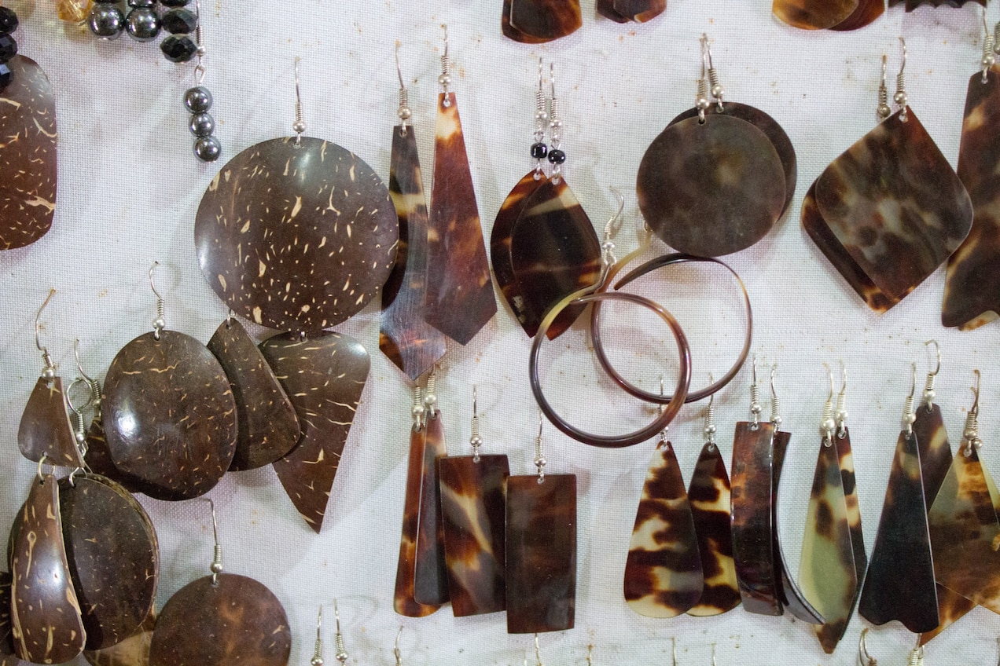

# Table of Contents

Location: <file:///Users/charlesthomas/Downloads/new_files/saved_resource.html>                                                        
A new app aims to help save critically endangered sea turtles

<table border="2" cellspacing="0" cellpadding="6" rules="groups" frame="hsides">

<tbody>
<tr>
</tr>
</tbody>
</table>

Artificial intelligence can spot illicit tortoiseshell with greater ease—a new frontier in the fight against the the illegal
wildlife trade.

With its durability and transfixing swirl of translucent amber and brown layers, tortoiseshell has been used for centuries to
make everything from jewelry to combs to dishware.

“It was plastic before plastic was invented because it’s so malleable,” says [1]Brad Nahill, co-founder and president of turtle
conservation group [2]SEE Turtles and a [3]National Geographic Explorer.

Tortoiseshell does not come from tortoises. It almost exclusively comes from the critically endangered [4]hawksbill turtle.
Between 1884 and 1992, [5]data show, at least nine million hawksbills [6]were killed and sold for their shells. Today, fewer
than 25,000 breeding females remain globally, and its international commercial trade is banned.

Nahill’s group is leading an effort to use modern technology to combat the illicit trade of this age-old material.
Tortoiseshell is widely and accurately replicated with resin, making it difficult to tell real from fake. SEE Turtles, with
partners at the [7]Smithsonian OCIO Data Science Lab, built an app to help.

[IMG4834]
[IMG_4834]

Tortoiseshell jewelry, pictured here in a Nicaragua gift shop, is made from the shell of the endangered hawksbill turtle. It's
still widely sold in tourist shops across more than 40 countries. 
Photograph courtesy of Hal Brindley/TravelForWildlife.com
Please be respectful of copyright. Unauthorized use is prohibited.

Named SEE Shell, the app uses machine learning to identify with 94 percent accuracy whether a photo of something with a
tortoiseshell pattern is real or faux. It’s the first mobile app to use computer vision to combat the illegal wildlife trade,
according to Alexander Robillard, a predoctoral fellow with the [8]Smithsonian’s Data Science Lab who built the computer model
that powers it, and it will help inform conservation-minded shoppers and law enforcement. (The app can be downloaded in the [9]
Apple App Store and [10]Google Play).

Black market sales of tortoiseshell persist in at least 40 countries, Nahill says, concentrated largely in Central America and
Southeast Asia. Vacationing travelers buying tortoiseshell trinkets from gift shops and souvenir booths account for the great
majority of the illicit sales.

The app is also valuable for the wealth of information it can provide. All images are uploaded to a private, centralized
database, with GPS coordinates for each, allowing SEE Turtles to identify hot spots for illicit sales.

“Even if we get a few hundred travelers actively using it and collecting data and avoiding buying real tortoiseshell, it’s a
great thing,” Nahill says. SEE Turtles plans to market the free app through social media campaigns and partnerships with other
conservation organizations.

Marine ecologist Emily Miller, who was not involved in development of the app but authored a 2019 paper [11]on the global scale
of the hawksbill trade, says that although many different groups around the world are collecting data on the hawksbill trade,
“one of the major barriers to answering research questions is consolidating, formatting, and organizing all of the data.”
Having a larger, centralized database “will be incredibly helpful to understanding trade patterns globally,” she says.

Training a computer to help protect turtles

Robillard worked with Nahill’s team to collect 4,000 images of real and fake tortoiseshell products. Robillard fed those images
into his computer model, which analyzed the pixels in each to learn the differences in shape and coloration between real and
fake tortoiseshell.

A key difference, Nahill says, is that patterning on real tortoiseshell is random. Faux products tend to have splotches with
uniform edges or the same pattern across different items that are sold together. The orange hue in faux tortoiseshell also
tends to have consistent translucency throughout.

Nahill and Robillard are good at distinguishing the real from the fake, but without the app, it may take years of practice for
a non-expert to develop that skill. “I like to tell people it puts Brad [Nahill] in their pocket!” Robillard says of the app.
Machine learning and computer vision “can do any visual task that a human can do, but more efficiently and rapidly,” he says.
(I tested SEE Shell on two pairs of tortoiseshell-patterned eyeglasses—and right away, it identified both as fake.)

Swizzle sticks and more

Through the app, scientists have already come across tortoiseshell products they didn’t know existed—tortoiseshell swizzle
sticks for mixing cocktails, for example, and cock-fighting spurs.

The app will be valuable for local conservation groups. Before its launch, [12]Fundación Tortugas del Mar, a turtle
conservation group in Cartagena, Colombia, already had success engaging local law enforcement to crack down on the trade,
reducing it in the region by nearly 80 percent. But, Nahill says, authorities only go on patrol if someone from the
conservation group accompanies them to help identify illegal products. Tortugas del Mar plans to train law enforcement to use
the app so they can work more quickly and independently.

David Godfrey, executive director of the [13]Sea Turtle Conservancy, whose work includes efforts to protect hawksbill turtles
in Panama, a hot spot for the trade, says that if tourists use SEE Shell, it’s like equipping “an army of conservationists to
make life difficult for people selling [tortoiseshell] under the table.” Now that people can identify the real thing right
away, vendors may think twice about carrying it, he says.

With help from the World Wildlife Fund for Nature, SEE Turtles also aims to bring the technology to online platforms, which
have seen a [14]surge in the illegal wildlife trade in recent years. Facebook, eBay, and others filter illegal products by
detecting listings that include prohibited keywords, but the filters are easily evaded. “As far as we can determine, no one has
done anything visually,” Nahill says.

This visual learning technology potentially can be adapted for other wildlife materials, such as discerning real bone from
fake. The ability to identify real elephant ivory in an instant would be particularly valuable, but it’s trickier than
tortoiseshell, Robillard notes, because a key indicator of authentic ivory is its internal crosshatch lines, which aren’t
visible in a photo.

Nonetheless, he says, “there’s a whole world of possibilities for applying machine learning to conservation issues.”

The National Geographic Society, committed to illuminating and protecting the wonder of our world, has funded Explorer Brad
Nahill’s past work on sea turtle conservation. [15]Learn more about the Society’s support of Explorers highlighting and
protecting critical species.

The National Geographic Society also supports Wildlife Watch, our investigative reporting project focused on wildlife crime and
exploitation. Read more [16]Wildlife Watch stories here, and send tips, feedback, and story ideas to [17]
NGP.WildlifeWatch@natgeo.com.
